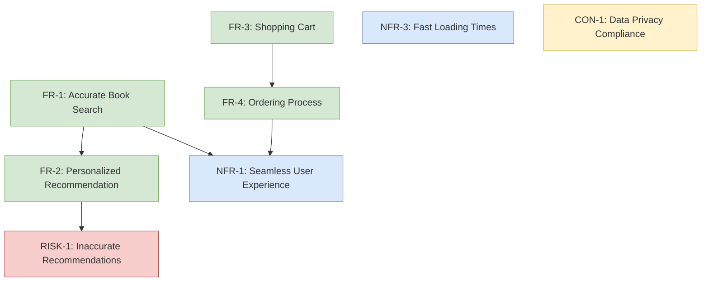

# coopagent

LangGraph 기반의 페르소나-인터뷰 요구사항 생성 에이전트. 자연어 요구를 인터페이스
계약(`InterfaceContract`)으로 구조화하고, 역할 기반 멀티 에이전트가 계약을
제안·비판·진화시켜 RAG 등 시스템의 워크플로 명세를 만들어낸다.

> 자세한 내용은 **[MANUAL.md](MANUAL.md)** (사용 매뉴얼) 참고.
> GitHub Codespaces 에서 실행하려면 **[CODESPACES.md](CODESPACES.md)** 참고.

## 빠른 시작

```powershell
powershell -ExecutionPolicy Bypass -File .\setup.ps1        # 1) 원클릭 셋업 (venv + 의존성 + .env 확인)
.\documentagent.ps1 "만들고 싶은 시스템 설명"                 # 2) 페르소나 인터뷰 → 요구사항 문서
.\ragproposal.ps1 --task "RAG 시스템 구축 요청" --out docs   # 3) RAG 계약 제안 생성
```

## 주요 명령

| 명령 | 설명 |
|---|---|
| `.\documentagent.ps1 "..."` | 페르소나 인터뷰 → 요구사항 문서 생성 (`--k` 페르소나 수) |
| `.\ragproposal.ps1 --task "..."` | 인터뷰 → 계약 합성 → 멀티 에이전트 제안/비판 → YAML 계약 산출 (`--out` 저장 위치) |

두 명령 모두 `--task`를 생략하면 대화형으로 입력을 받는다.

## 요구사항 그래프

`documentagent --graph` 로 요구사항을 **노드(기능/비기능/제약/리스크) + 의존관계
엣지**의 그래프로 구조화한다. 결과는 `docs/requirements_graph.md` 에 Mermaid 로
저장되며, GitHub 에서 아래처럼 렌더링된다:



> 전체 생성 예시는 [docs/requirements_graph.md](docs/requirements_graph.md) 참고.

## 프로젝트 구조

```
src/documentation_agent/   # 페르소나-인터뷰 + 계약 합성/진화 파이프라인
src/agents/                # 역할 에이전트 (Retriever/Ranker/Orchestrator/Evaluator/Logger)
src/rag/                   # 제안된 RAG 계약의 실행 코드 (평가/재랭킹/출처 추적)
test/                      # pytest 단위 테스트
docs/                      # 생성 산출물 (YAML 계약, 요구사항 문서, 분석)
```

## 설정

`.env` 파일에 API 키를 설정해야 한다 (git 에는 커밋되지 않음):

```
OPENAI_API_KEY=sk-...
```

## 테스트

```powershell
.\.venv\Scripts\python.exe -m pytest test -q      # pytest
cmake -S . -B build ; ctest --test-dir build -C Release --output-on-failure   # CTest 래핑
```
