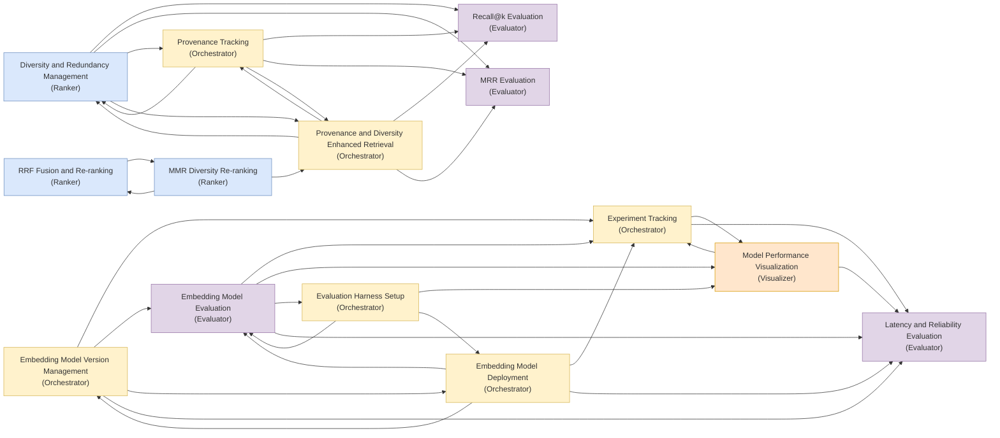

# ?? ???

```mermaid
flowchart LR
    classDef retriever fill:#d5e8d4,stroke:#82b366
    classDef ranker fill:#dae8fc,stroke:#6c8ebf
    classDef orchestrator fill:#fff2cc,stroke:#d6b656
    classDef evaluator fill:#e1d5e7,stroke:#9673a6
    classDef logger fill:#f8cecc,stroke:#b85450
    classDef optimizer fill:#f5f5f5,stroke:#666666
    classDef visualizer fill:#ffe6cc,stroke:#d79b00
    Embedding_Model_Version_Management["Embedding Model Version Management<br/>(Orchestrator)"]:::orchestrator
    Recall_k_Evaluation["Recall@k Evaluation<br/>(Evaluator)"]:::evaluator
    MRR_Evaluation["MRR Evaluation<br/>(Evaluator)"]:::evaluator
    Experiment_Tracking["Experiment Tracking<br/>(Orchestrator)"]:::orchestrator
    Model_Performance_Visualization["Model Performance Visualization<br/>(Visualizer)"]:::visualizer
    Embedding_Model_Evaluation["Embedding Model Evaluation<br/>(Evaluator)"]:::evaluator
    Embedding_Model_Deployment["Embedding Model Deployment<br/>(Orchestrator)"]:::orchestrator
    Diversity_and_Redundancy_Management["Diversity and Redundancy Management<br/>(Ranker)"]:::ranker
    RRF_Fusion_and_Re_ranking["RRF Fusion and Re-ranking<br/>(Ranker)"]:::ranker
    Evaluation_Harness_Setup["Evaluation Harness Setup<br/>(Orchestrator)"]:::orchestrator
    Latency_and_Reliability_Evaluation["Latency and Reliability Evaluation<br/>(Evaluator)"]:::evaluator
    MMR_Diversity_Re_ranking["MMR Diversity Re-ranking<br/>(Ranker)"]:::ranker
    Provenance_Tracking["Provenance Tracking<br/>(Orchestrator)"]:::orchestrator
    Provenance_and_Diversity_Enhanced_Retrieval["Provenance and Diversity Enhanced Retrieval<br/>(Orchestrator)"]:::orchestrator
    Embedding_Model_Version_Management --> Experiment_Tracking
    Embedding_Model_Version_Management --> Embedding_Model_Evaluation
    Embedding_Model_Version_Management --> Embedding_Model_Deployment
    Embedding_Model_Version_Management --> Latency_and_Reliability_Evaluation
    Experiment_Tracking --> Model_Performance_Visualization
    Experiment_Tracking --> Latency_and_Reliability_Evaluation
    Model_Performance_Visualization --> Experiment_Tracking
    Model_Performance_Visualization --> Latency_and_Reliability_Evaluation
    Embedding_Model_Evaluation --> Experiment_Tracking
    Embedding_Model_Evaluation --> Model_Performance_Visualization
    Embedding_Model_Evaluation --> Evaluation_Harness_Setup
    Embedding_Model_Evaluation --> Latency_and_Reliability_Evaluation
    Embedding_Model_Deployment --> Embedding_Model_Version_Management
    Embedding_Model_Deployment --> Experiment_Tracking
    Embedding_Model_Deployment --> Embedding_Model_Evaluation
    Embedding_Model_Deployment --> Latency_and_Reliability_Evaluation
    Diversity_and_Redundancy_Management --> Recall_k_Evaluation
    Diversity_and_Redundancy_Management --> MRR_Evaluation
    Diversity_and_Redundancy_Management --> Provenance_Tracking
    Diversity_and_Redundancy_Management --> Provenance_and_Diversity_Enhanced_Retrieval
    RRF_Fusion_and_Re_ranking --> MMR_Diversity_Re_ranking
    Evaluation_Harness_Setup --> Model_Performance_Visualization
    Evaluation_Harness_Setup --> Embedding_Model_Evaluation
    Evaluation_Harness_Setup --> Embedding_Model_Deployment
    MMR_Diversity_Re_ranking --> RRF_Fusion_and_Re_ranking
    MMR_Diversity_Re_ranking --> Provenance_and_Diversity_Enhanced_Retrieval
    Provenance_Tracking --> Recall_k_Evaluation
    Provenance_Tracking --> MRR_Evaluation
    Provenance_Tracking --> Diversity_and_Redundancy_Management
    Provenance_Tracking --> Provenance_and_Diversity_Enhanced_Retrieval
    Provenance_and_Diversity_Enhanced_Retrieval --> Recall_k_Evaluation
    Provenance_and_Diversity_Enhanced_Retrieval --> MRR_Evaluation
    Provenance_and_Diversity_Enhanced_Retrieval --> Diversity_and_Redundancy_Management
    Provenance_and_Diversity_Enhanced_Retrieval --> Provenance_Tracking
```
