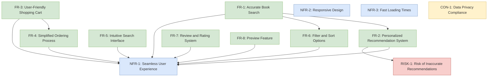

# 요구사항 그래프

```mermaid
flowchart TD
    classDef functional fill:#d5e8d4,stroke:#82b366
    classDef non_functional fill:#dae8fc,stroke:#6c8ebf
    classDef constraint fill:#fff2cc,stroke:#d6b656
    classDef risk fill:#f8cecc,stroke:#b85450
    FR-1["FR-1: Accurate Book Search"]:::functional
    FR-2["FR-2: Personalized Recommendation System"]:::functional
    FR-3["FR-3: User-Friendly Shopping Cart"]:::functional
    FR-4["FR-4: Simplified Ordering Process"]:::functional
    FR-5["FR-5: Intuitive Search Interface"]:::functional
    FR-6["FR-6: Filter and Sort Options"]:::functional
    FR-7["FR-7: Review and Rating System"]:::functional
    FR-8["FR-8: Preview Feature"]:::functional
    NFR-1["NFR-1: Seamless User Experience"]:::non_functional
    NFR-2["NFR-2: Responsive Design"]:::non_functional
    NFR-3["NFR-3: Fast Loading Times"]:::non_functional
    CON-1["CON-1: Data Privacy Compliance"]:::constraint
    RISK-1["RISK-1: Risk of Inaccurate Recommendations"]:::risk
    FR-1 --> FR-2
    FR-3 --> FR-4
    FR-1 --> FR-6
    FR-1 --> NFR-1
    FR-2 --> NFR-1
    FR-3 --> NFR-1
    FR-4 --> NFR-1
    FR-5 --> NFR-1
    FR-6 --> NFR-1
    FR-7 --> NFR-1
    FR-8 --> NFR-1
    FR-2 --> RISK-1
```
